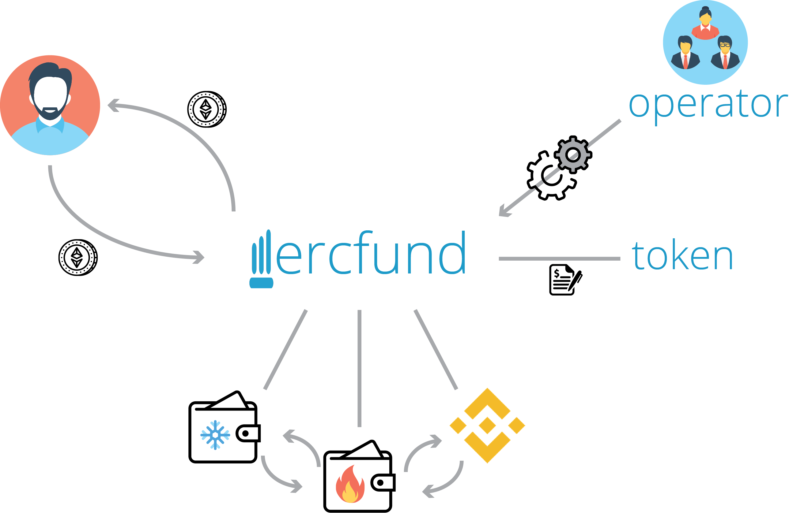

# ERCfund
### An open-ended hedge fund implementation on the Ethereum blockchain for managing ERC20 tokens.


## What is ERCFund?
ERCFund makes it possible to invest into an actively managed portfolio of ERC20-Tokens and Ether by introducing a on-demand minted and burned token as the medium for shares in the fund. 
Compared to some other closed-end funds (e.g., TaaS.fund, The Token Fund) you can buy shares/tokens at any time by simply sending Ether to the fund.
These shares/tokens can also be sold at any time by calling the withdraw function of the fund which sends the corresponding value of Ether back to a specified wallet.

Fund managers can freely trade with these tokens and hopefully make profits. Based on the assets under management the price for one token should be continously updated.


### Vision
Currently investing in a range of different cryptocurrencies requires a lot of technical knowledge. This has spawned the need for easy way to invest while reducing entry barriers. Multiple well-known and successful initiatives are on the market like Crypto20, ICONOMI, Melon, Grayscale, etc. 

However the sector of cryptocurrency investment is difficult to enter for smaller, independent investors who possess market knowledge and are experienced in traditional fields but simply lack the technical knowledge to offer a product in the cryptocurrency sector.

ERCFund strives to provide an safe, extensible implementation of a hedge fund for ERC20 tokens. Security and trust is immensly important for lesser known players. For this reason all parts of the fund are rigorously tested and reuse community-audited code from OpenZeppelin. Furthermore it provides the possibility to add external trust parties to the management team which can make prospective investors feel secure by preventing fund managers to mishandle their money.

### Architecture 


In the picture above you can get a rough overview of the implementation. The whole fund structure can be setup with the four Solidity classes:

- FundOperator.sol
- Fund.sol
- FundToken.sol
- FundWallet.sol

#### Fund
The fund is the connection piece between all of the classes. It implements the core functionality of a hedge fund. The fund can manage an arbitrary number of wallets and can send Ether or ERC20-compatible tokens from these wallets.

Additionally the fund lets interested individuals purchase and sell "shares" of the fund in the form of a FundToken. These tokens are dynamically created and burned based on the current price of the fund and fees of the fund. This price should be continously updated by the fund operators.

#### FundToken
The fund token is standard, burnable and mintable ERC20 token. The token itself does not implement any direct functionality of the fund. However it is different to normal burnable tokens in the way that only the owner (the fund) can burn tokens.

#### FundOperator
The FundOperator class is multi-signature contract on top of the fund class in order to introduce a layer of security. It is different to other multi-signature wallets (like the Gnosis multi-sig wallet) in several ways.

Owners of the FundOperator are split into two different groups: the fund managers and the trust party. Depending on the actions called in the FundOperator class either only signatures of the fund managers are needed or signatures of both groups. Members of the trust party group could be e.g., an external audit firm, a group of significant investors or generally trusted personalities. 

Still, the trust party group is fully optional!

The idea behind this trust structure is that the fund managers can normally trade and manage the funds within a defined trusted area (e.g., internal wallets and exchanges). If they want to introduce a new wallet or send to an untrusted wallet they have to get additional signatures. This prevents anybody managing the fund from maliciously moving Ether or tokens.

Furthermore the FundOperator class implements the addition of cold wallets to the fund, which are especially safe wallets which were never connected to the internet.
This is possible because signing an action for fund happens off-chain instead of on-chain (like the Gnosis multi-sig wallet). Signing on-chain has pros and cons, the main pro is, is that it is simpler to use, because you do not need a special application to sign your transactions off-chain. The cons are that transactions are more expensive, because you need to send a confirmation from key holder, also signing off-chain is arguably more secure if done right.
An actively managed fund might need to make hundreds of transactions every day, signing off-chain decreases transaction cost significantly.

## FAQ

#### - [I want to create a fund running on your smart contracts! How would I go about doing this?](FAQ.md#i-want-to-create-a-fund-running-on-your-smart-contracts-how-would-i-go-about-doing-this)
#### - [Why does the fund not implement the withdraw pattern?](FAQ.md#why-does-the-fund-not-implement-the-withdraw-pattern)
#### - [I do not understand the signature verification in the FundOperator class](FAQ.md#i-do-not-understand-the-signature-verification-in-the-fundoperator-class)
#### - [What are the pros of an open-ended fund compared to a closed-end fund?](FAQ.md#what-are-the-pros-of-an-open-ended-fund-compared-to-a-closed-end-fund)
#### - [How am I supposed to change owners of the Fund Operator?](FAQ.md#how-am-i-supposed-to-change-owners-of-the-fund-operator)

## Contributing

I really appreciate any contributions and feedback regarding the project. Please clone the repository and make a pull request in the repository after you have changed something.

Setup is really easy by simply running `npm install` in your cloned repository.
Afterwards you can run tests, coverage and linting like so:

```
npm test
npm run coverage
npm run lint
```

Before creating a pull request make sure to run all tests and lint your code to check if all changes can be adopted.

## Contact

I have created a [slack channel] where you can ask any questions about the repository or directly contact me.

### About me

I am currently finishing up my master studies at the Technical University of Vienna. I am both interested in blockchain-related tech and finance and developed this software as part of my master thesis.
The master thesis will be published at least partly in the coming months.

## Special Thanks To

 - [OpenZeppelin](https://github.com/OpenZeppelin/zeppelin-solidity): I reused many of their community-audited code for simple functions of the fund. I find their initiative great and it was my main resource on learning how to program in Solidity.
 - [Christian Lundkvist's simple-multisig](https://github.com/christianlundkvist/simple-multisig): I got my inspiration for the Fund Operator's multi-sig functionality from Christian's simple-multisig wallet implementation. 

## License

All parts of this repository except for the files in the "imgs/"-folder are licensed under the MIT License (some icons used cannot be relicensed).

Parts of the repository are copyrighted (c) 2016 Smart Contract Solutions, Inc. (a.k.a OpenZeppelin), namely everything in the "open-zeppelin"-folders and "scripts"-folder.

Icons used in the graphic above are made by Smashicons, Freepik, Vectors Market, EpicCoders and Gregor Cresnar from www.flaticon.com.


